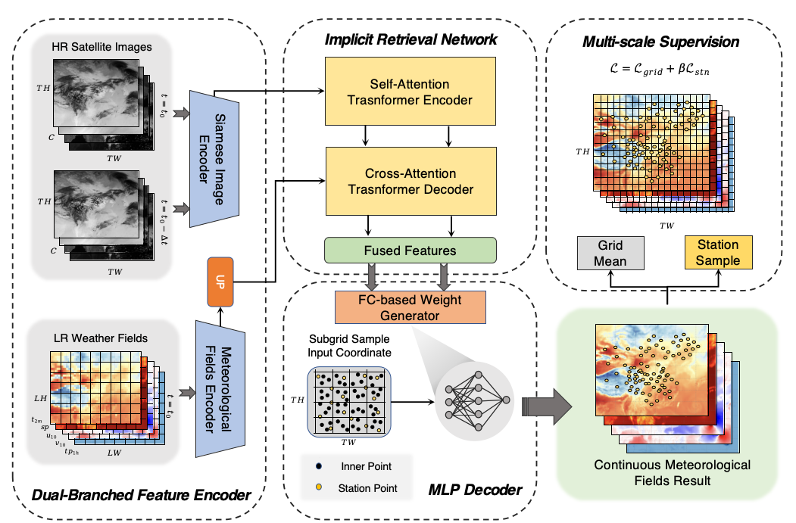

<div align="center">
    <h2>
        Deriving Accurate Surface Meteorological States at Arbitrary Locations via Observation-Guided Continous Neural Field Modeling   
    </h2>
</div>


[](LICENSE)
[](https://ieeexplore.ieee.org/abstract/document/10643214/)
[](https://arxiv.org/abs/2401.11960)

<div align="center">
    
</div>

## Introduction

This repository is the code implementation of the paper [Deriving Accurate Surface Meteorological States at Arbitrary Locations via Observation-Guided Continous Neural Field Modeling](https://ieeexplore.ieee.org/abstract/document/10643214/).

The current branch has been tested under PyTorch 2.x and CUDA 12.1, supports Python 3.7+, and is compatible with most CUDA versions.

## TODO


## Table of Contents

- [Introduction](#Introduction)
- [TODO](#TODO)
- [Table of Contents](#Table-of-Contents)
- [Installation](#Installation)
- [Dataset Preparation](#Dataset-Preparation)
- [Model Training](#Model-Training)
- [Model Inference](#Inference)
- [Citation](#Citation)
- [License](#License)
- [Contact](#Contact)

## Installation

### Dependencies

- Linux or Windows
- GDAL 3.0 or higher, recommended 3.6.2
- Python 3.7+, recommended 3.10
- PyTorch 2.0 or higher, recommended 2.1
- CUDA 11.7 or higher, recommended 12.1
- [cfgrib](https://github.com/ecmwf/cfgrib) 0.9 or higher, recommended 0.9.10
- [xarray](https://docs.xarray.dev/en/latest/getting-started-guide/installing.html) 2023.12.0
- [NETCDF4](https://unidata.github.io/netcdf4-python/) 1.6.5 or higher, recommended 1.6.5
- [Metpy](https://unidata.github.io/MetPy/latest/userguide/installguide.html) 1.0 or higher, recommended 1.6
 

## Inference
_TODO_

## Citation

If you use the code or performance benchmarks of this project in your research, please refer to the bibtex below to cite.

```
@article{liu2024observation,
  title={Observation-Guided Meteorological Field Downscaling at Station Scale: A Benchmark and a New Method},
  author={Liu, Zili and Chen, Hao and Bai, Lei and Li, Wenyuan and Chen, Keyan and Wang, Zhengyi and Ouyang, Wanli and Zou, Zhengxia and Shi, Zhenwei},
  journal={arXiv preprint arXiv:2401.11960},
  year={2024}
}
}
```

## License

This project is licensed under the [Apache 2.0 license](LICENSE).

## Contact

If you have any other questions or suggestions, please contact Zili Liu ([liuzili@buaa.edu.cn](mailto:liuzili@buaa.edu.cn)).
